## 操作系统的功能
* 管理系统软硬件资源
* 拓展计算集的功能
* 向用户提供服务

# 课程大纲
* 操作系统的概述
* 用户接口及作业管理
* 进程及控制
* 进程同步与互斥
* 进程间的通信
* 死锁
* 处理机调度
* 存储管理
* 文件系统
* 外部设备管理

### 2021.03.20

* 应用软件在系统软件支持下工作，系统软件在硬件支持下工作

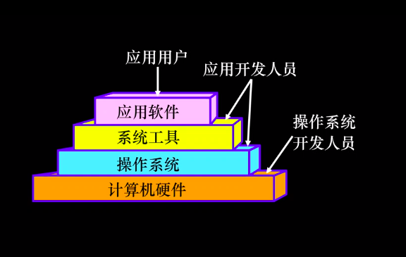

* 操作系统的地位：紧贴系统硬件之上，所有其他软件之下（是其他软件的共同环境）

* 操作系统承担于硬件相关、与应用无关的基本工作，并解决这些基本工作中的效率和安全问题，为让用户方便、高效、安全地使用计算机，而从最底层统一提供通用的帮助和管理。

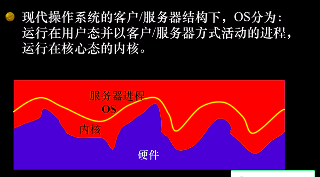

* 操作系统把用户的高级操作转换成一系列低级操作，所有低级操作对用户都是通明的。操作系统把硬件全部隐藏起来，给用户提供一个友好的、易于操作的界面。此外，操作系统还要进行大量的事物处理。

#### 操作系统的定义：
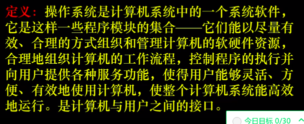

##### 2021.03.23 21:18
## 1.4 操作系统的发展历史
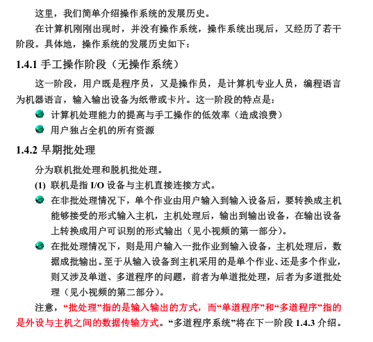

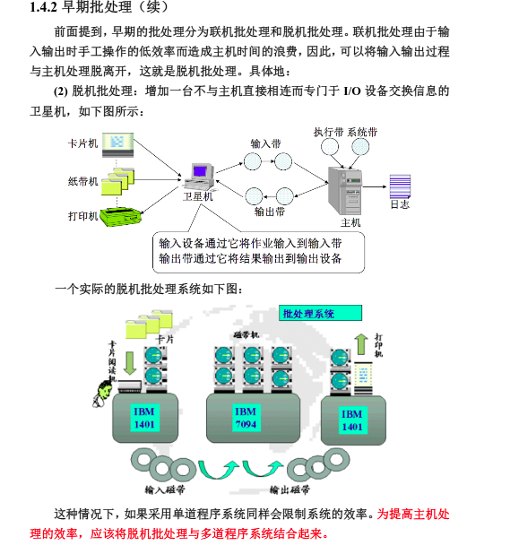

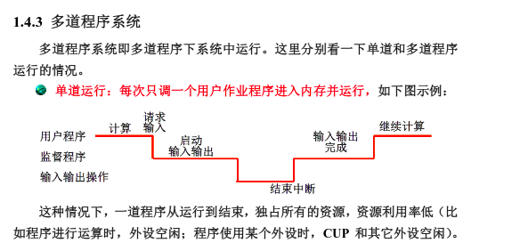

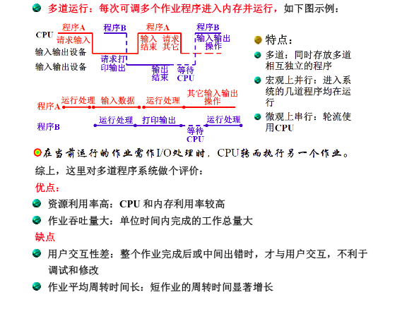

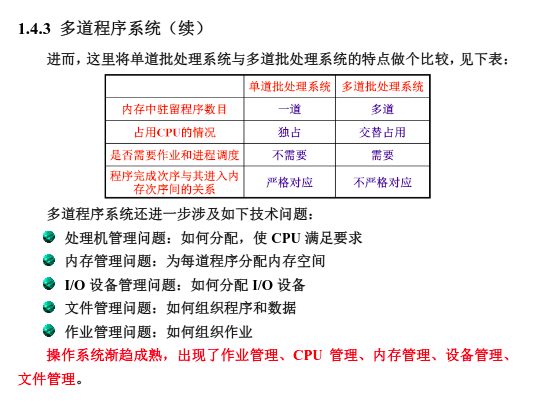

#### 联机批处理
* I/O 设备与主机直接连接
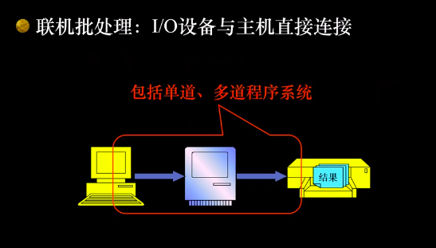
* * 作业输入和结果输出过程中，CPU处于等待状态

#### 脱机批处理
* 增加一台不与主机直接相连而专门于I/0设备交换信息的卫星机。
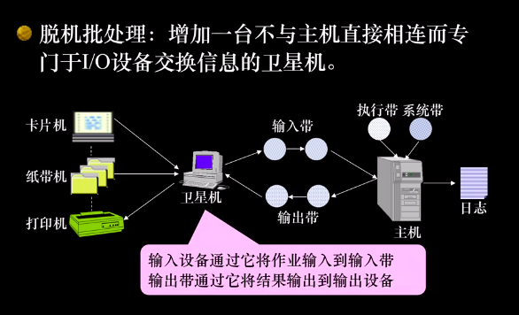

#### 单道程序系统
* 每次只调一个用户作业程序进入内存并运行

#### 多道程序系统
* 每次可调多个作业程序进入内存并运行。

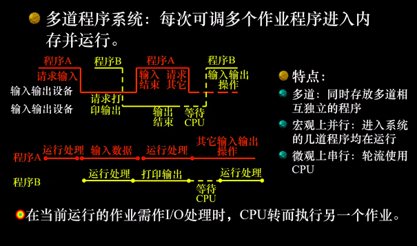

## 1.5 操作系统的分类

#### 分时系统
* 多个用户分享使用同一台计算机，分时共享硬件和软件资源

##### 如何分时
* 多个用户分时
* * 单个用户使用计算机的效率低，因而允许许多应用程序同时在内存中，分别服务于不同的用户
* 前台和后台程序分时
* * 后台程序不占用终端输入输出，不与用户交互——现在的图形界面（GUI），除当前交互的程序（输入焦点）之外，其他程序均作为后台

##### 处理机制
* 通常按时间片分配
* * 各个程序在CPU上的执行的轮换时间。把处理器的运行时间分成很短的时间片，按照时间片轮流吧处理机分配给各作业。
